# Artificial Intelligence and Data Science Project Portfolio

This repository presents a collection of ***personal AI and data science projects*** (mostly in the form of iPython Notebook). This portfolio does not include my (academic) research-related projects for confidentiality reasons. While the topics and datasets being explored in this portfolio are chosen based on my own interest, the primary focus of the projects is to employ various state-of-the-art techniques of AI and data modelling to extract buried potentials of the datasets on hand.

Many side projects are currently on-going in separate repositories and they will be continuously merged into this portfolio repository for presentation.

While each jupyter notebook is self-explanatory, required modules can be found in the "requirement.txt" contained in each project folder. If you wish to install the requirements, simply run `pip install -r requirements.txt` in your virtual environment. 

Any questions or feedback regarding this portfolio can be kindly directed to the author, ***Sean Choi***, at ***ss.sean.choi@gmail.com*** or ***ss.choi@mail.utoronto.ca***.

## Articles and tutorials

If interested, please also take a look at ***my articles on various Artificial Intelligence, Deep Learning, Machine Learning and Data Science research topics*** [***HERE***](https://github.com/sungsujaing/Artificial_Intelligence_articles_and_tutorials).

*Article/tutorial topics include*:

* Distributed training with Keras and TensorFlow data module
* Exploring GAN, WGAN and StyleGAN
* Face recognition using OpenFace
* Comparison studies (pros/cons) on various supervised machine learning models
* and many more!!

## Current list of projects
* [**Two-style Neural Transfer**](#two-style-neural-transfer-or-full-repository)
* [**KnowYourMove - store traffic analyzer**](#knowyourmove-or-full-repository)
* [**Handwritten Letters/Digits generator (LDG_v3)**](#handwritten-letters-and-digits-generator-ldg_v3-or-full-repository)
* [**TV time tracker based on face recognition (TTT_v3)**](#tv-time-tracker-based-on-face-recognition-ttt_v3-or-full-repository)
* [**Online-image-based Happy Dog Classifier (HDC_v2)**](#online-image-based-happy-dog-classifier-hdc_v2-or-full-repository)
* [**Morphology-based skin cancer classification**](#morphology-based-skin-cancer-classification)
* [**Forest Fire area prediction**](#forest-fire-area-prediction)
* [**Motion-sensor-based human motion prediction and subject identification**](#motion-sensor-based-human-motion-prediction-and-subject-identification)
* [**Malignant breast tumor detection**](#malignant-breast-tumor-detection)
* [**Retail sales prediction**](#retail-sales-prediction)
* [**Data analysis and visualization**](#data-analysis-and-visualization)
* [**Mini capstone project for fast prototyping**](#mini-capstone-project-for-fast-prototyping)

## Project summaries
#### [*tools: TensorFlow-gpu, Keras, OpenCV, Scikit-Learn, Flask, Pandas, Matplotlib, Seaborn, etc.*]

### [Two-style Nueral Transfer][31] (or [*Full repository*](https://github.com/sungsujaing/NeuralStyleTransfer_custom))

Developed a custom **two-style neural style transfer** that combines styles of two different arts to redraw the third art piece in a unique way. A pre-trained VGG16 model was used to extract styles and contents from arbitrary images. Unlike the conventional one-style transfer approach, different low-level features were optimized for different styles of arts, thus allowing both styles to be reflected when reconstructing the content image. Many hyperparameters are involved in this fitting process. Thus, based on specific purposes, hyperparameters can be adjusted to create unique results. For demo purposes, art images were obtained from Google. 

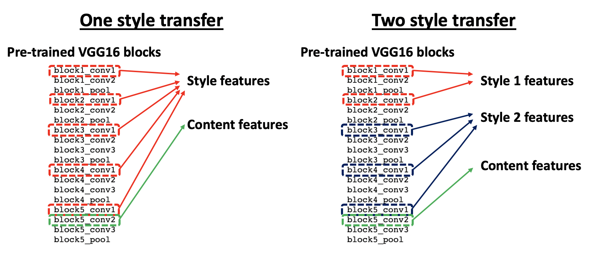

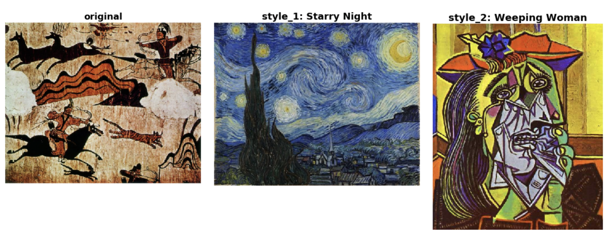

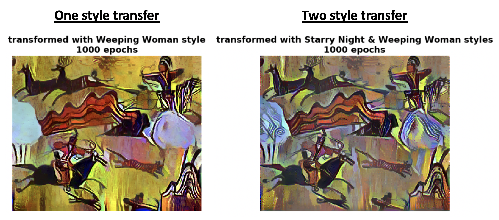

### [KnowYourMove][30] (or [*Full repository*](https://github.com/sungsujaing/INSIGHT-project))

Deployed computer-vision-based business intelligence tool (**KnowYourMove**) that analyzes time-specific store traffics from store surveillance camera systems. By tracking the motion of individual customers over time (**based on Single Shot Detector and centroid tracking algorithm**), KnowYourMove generates information maps that can provide business owners with hidden insights to understand their customers better (in terms of their shopping routes and aggregated time spent in different areas). KnowYourMove has been deployed as a [**web application**](http://www.knowyourmove.store/) (currently hosted on AWS t2.micro) where a user can upload a surveillance video (or use videos from YouTube) to generate the reports. The information can be filtered by specific time windows (i.e. morning/afternoon or weekdays/weekends, etc). Such information is expected to provide time-specific customer traffics at a store so as to enable micro-optimization of business operations such as store floor plannings and pricing strategy without breaching customer privacy.

### [Handwritten Letters and Digits generator (LDG_v3)][29] (or [*Full repository*](https://github.com/sungsujaing/letter_digit_generator_VAE))

Developed **(convolutional) conditional variational autoencoder (CVAE)**-based handwritten letters/digits generator. Trained on the EMNIST dataset (62 claases compriding [0-9], [a-z] and [A-Z]), the generator can produce new handwritten-like letters/digits based on the typed inputs. Both convolutional and vanilla models are being investigated for comparison purposes. While the models are not yet optimized, their reconstruction results look satisfactory.

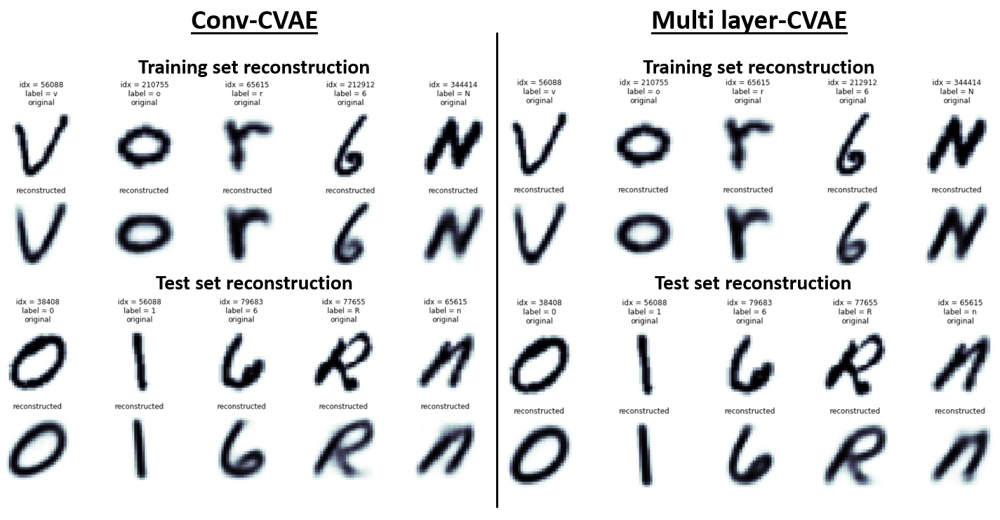

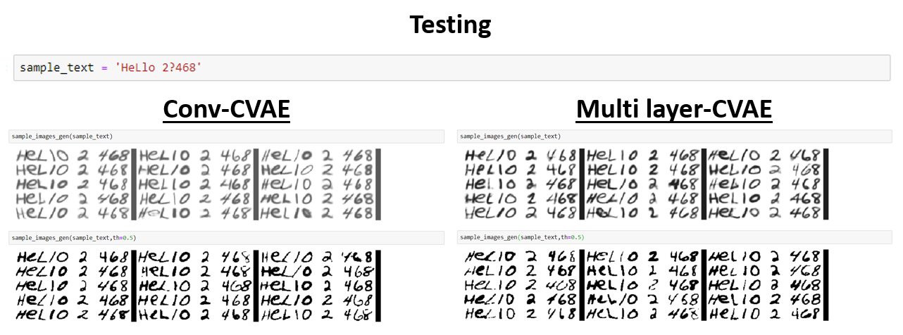

***[ldg_v3_gen](https://github.com/sungsujaing/Artificial_Intelligence_Data_Science_Portfolio/blob/master/Letter_digit_generator/ldg_v3_gen.py)*** is a command-line letters/digits generator based on ldg_v3 Conv-CVAE model. It simply loads the Conv-CVAE model and the corresponding weights (best) to produce the results.

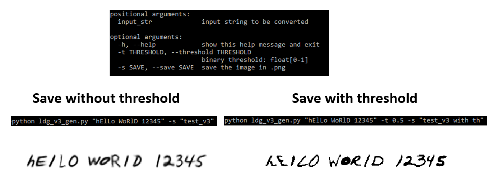

### [TV time tracker based on face recognition (TTT_v3)][28] (or [*Full repository*](https://github.com/sungsujaing/TV_time_tracking_face_recognition))

Built a tracker that recognizes the faces of registered individuals to measure the time they spend watching the camera (or watching TV in the final application). Developed on top of [Keras-OpenFace](https://github.com/iwantooxxoox/Keras-OpenFace), a project converting OpenFace from its original Torch implementation to a Keras version, the current version of TTT (TTT_v3) showed great accuracy of ~ 88% in recognizing my face + measuring time me watching a camera in a video format. In the upcoming versions, TTT will be implemented into a real-time module to be mounted on a TV to finalize the project.

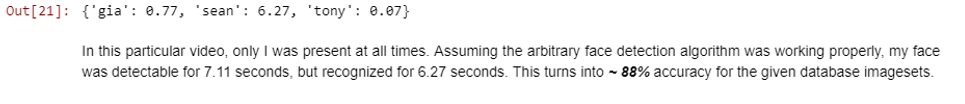

### [Online-image-based Happy Dog Classifier (HDC_v2)][27] (or [*Full repository*](https://github.com/sungsujaing/Happy_Dog_Detection))

Built **a customized CNN model with ResNET50-like residual blocks**. Trained it with a small image set that was prepared from Google using google-images-download module. After searching for the optimized hyperparameters, the final model could achieve ~ 90% accuracy on a test set and the model was eventually applied to predict the happiness of my puppy, Lucky. Many of the mislabeled images were turned out to be very difficult even for me to classify as happy or sad. Acknowledging the difficulties associated with reading dogs' emotions, I have to admit that the quality of the downloaded training data must have been compromised to some degree. Nonetheless, the best model/weights have been saved.

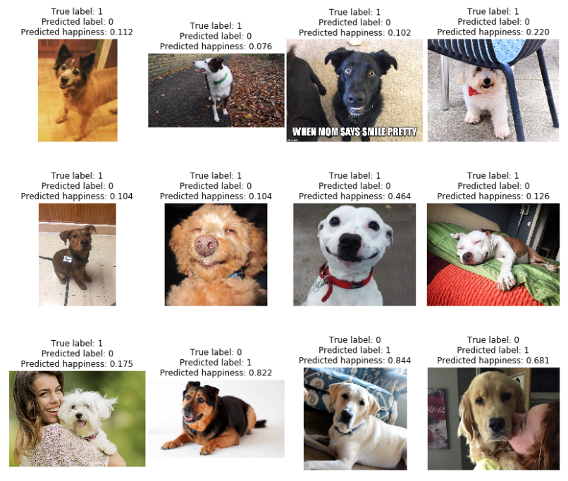
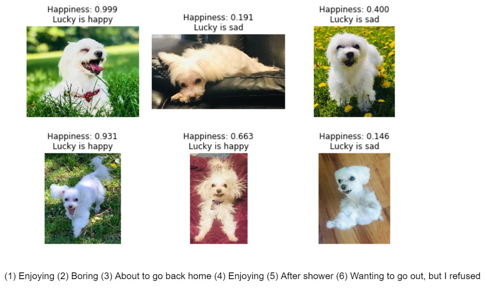

#### Happy Dog Detector (HDD)
In the ongoing **HappyDogDetector (HDD)** development, ***a customized YOLO model was integrated to the best model built in HDC_v2*** in order to localize happy dogs in given images/videos. For this first version (HDD_v1), the pretrained YOLO weights were used to identify dogs among 80 predictions, but in the upcoming versions, newly-trained weights will be used to localize only the face of a dog to improve the accuracy of the final model. 

[***Current HDD_v1***](https://github.com/sungsujaing/Happy_Dog_Detection/blob/master/custom_darkflow/HappyDogDetector_v1.ipynb) on a YouTube video (detecting only **Happy**)
*Video source: [here](https://www.youtube.com/watch?v=0lEUiQEDUHM)*

***Current HDD_v1*** on images (detecting both **Happy and Sad**)

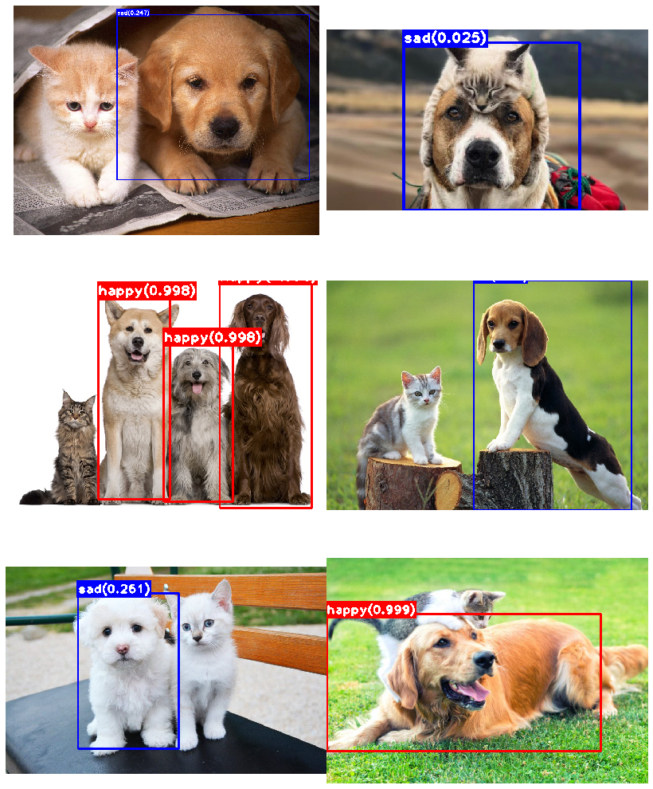

The current HDD_v1 localizes dogs from given images/vidoes and classify if he/she is happy (or optionally sad as well). The system is planned to be built into a realtime detection module in the upcoming HDD versions.

### [Morphology-based skin cancer classification][1]

Designed a customized CNN model and implemented ***a transfer learning on VGG16*** that achieved ~ 80% accuracy in classifying 7 different skin cancer types. While the target variables were highly imbalanced, the final model constructed was shown to well differentiate different classes solely based on their morphology. Intermediate layers of CNN were also visualized for deeper understanding of the system. The best model/weights have been saved.

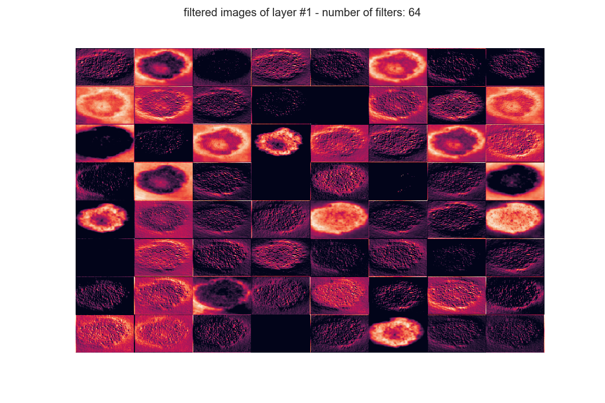
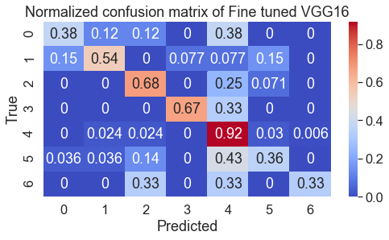

### [Forest Fire area prediction][2]

Constructed regression model using ***XGBooster regressor*** that can estimate the burning area from the future forest fire. In order to deal with the highly imbalanced target variable, the oversampling approach was taken to help the model to be sensitive to a small chance of forest fire occurrence. With the corresponding feature selection process, the model could achieve the RMSE of ~3.2.

### [Motion-sensor-based human motion prediction and subject identification][3]

Analyzed motion sensor signals from human subjects in Time-domain and Frequency-domain to confirm their differentiability. Furthermore, a various statistical technique like t-SNE was employed to visualize how different motions of different subjects fall into the same cluster. ***XGBoost classifier*** was trained to predict the motion and even identify the specific subject with >95% accuracy with only using the small portion of the available data. The most useful sensors in general in terms of predicting specific motions and subject were gyrometers on arms and ankles. Only a subset of available data (i.e. sensors on the wrist) has been tested for their prediction power.

### [Malignant breast tumor detection][4]

As an extension of my Master's project, malignant breast tumor detection problem was explored using ***KNN and SVM classifiers***. The metrics was carefully chosen so that to optimize the model that can avoid as much false-positives (predict as benign while it is malignant) as possible. The performance of the two constructed models was compared with that of a dummy classifier. While the KNN achieved ~ 99% precision, a highly tuned SVM classifier could achieve 100% precision while compromising its recall to some extent.

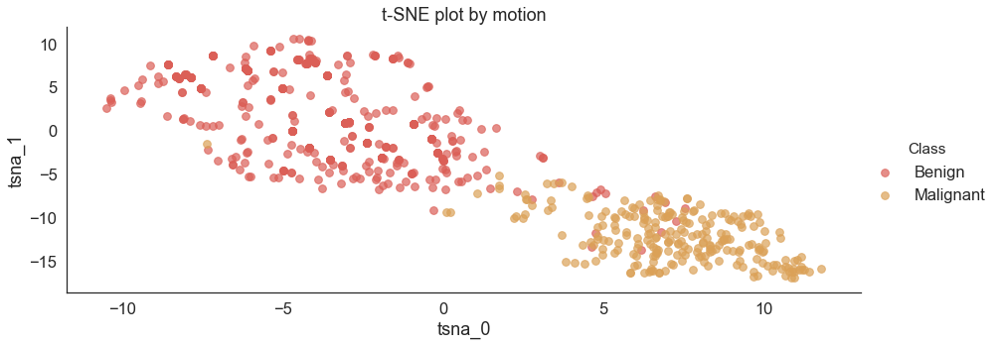

### [Retail sales prediction][5]

Constructed an ***ensemble model*** to predict a purchase amount of new potential customers based on their low-level information such as Gender and Age group. A risk of data leakage, along with a careful feature engineering/selection, was investigated.

### Data analysis and visualization
#### [*tools: Scikit-Learn, Pandas, Matplotlib, Seaborn, etc.*]
#### [911 call type][11]
The 911 call dataset was cleaned and organized by implementing various ***feature engineering/extraction techniques***.
#### [stock price][12]
Analyzed daily returns of FANG (Facebook, Amazon, Netflix and Google) stocks between 2013/01/01 and 2018/01/01. A brief ***EDA on the fetched data from online*** could reveal the information that can help in future investment.

### Mini capstone project for fast prototyping 
#### [*tools: TensorFlow, Scikit-Learn, Pandas, Matplotlib, Seaborn, Hyperopt, etc.*]
#### [Bank note authentication prediction][21]
Roughly constructed ***DNN*** was employed to differentiate the authentic and fake bank notes. Its classification accuracy was compared to that of a highly-tuned logistic regression model to test its performance.  
#### [yelp review star prediction][22]
Implemented ***NLP*** technique for processing the raw text data from Yelp. Quickly tested a few techniques like TF-IDF transformation to investigate their effectiveness on predicting the number of stars from the reviews using multinomial ***Naive Bayes classifier***.
#### [College type prediction][23]
Famous clustering algorithms such as ***K-means and Agglomerative clusterings*** have been implemented in order to separate two groups of colleges (public and private). With the true labels, the clustering performance of each model has been evaluated.
#### [Advertisement click prediction][24]
Designed and tuned the simple ***logistic regression*** model in order to predict if the new user would click the advertisement. With a tuning of regularization parameter, the prediction accuracy could improve to ~97% from ~89% with the minimum effort.
#### [Anonymous data classification][25]
A ***KNN*** model was trained in order to classify the anonymous dataset. Various hyperparameter optimization techniques were explored including ***the manual search, random search and sequential-model-based (Bayseian-based) optimization search***. Given the simplicity of the given anonymous dataset, the optimized results in the different search models resulted in the same error score, but it was clearly shown that the Bayseian-based optimization search could automatically find the optimal hyperparameters faster and more efficiently by focusing on the specific region of the multi-dimensional hyperparameter space that is more likely to improve the model performance.

#### [Loan payback prediction][26]
Constructed and compared basic ***tree-based models*** for their performance on a prediction of loan payback based on LendingClub profiles. 

[1]:https://github.com/sungsujaing/Artificial_Intelligence_Data_Science_Portfolio/blob/master/SkinCancerClassification_CNN/SkinCancerClassification.ipynb
[2]:https://github.com/sungsujaing/Artificial_Intelligence_Data_Science_Portfolio/blob/master/EstimatingDamageFromForestFire/Forest_Fire_Prediction_Model.ipynb
[3]:https://github.com/sungsujaing/Artificial_Intelligence_Data_Science_Portfolio/blob/master/HumanAndMotionPrediction/Mobile_Human_Motion_Prediction.ipynb
[4]:https://github.com/sungsujaing/Artificial_Intelligence_Data_Science_Portfolio/blob/master/PrognosticBreaseTumorDetection/BenignBreatTumorDetection.ipynb
[5]:https://github.com/sungsujaing/Artificial_Intelligence_Data_Science_Portfolio/blob/master/RetailSalesPrediction_BlackFridayAnalysis/BlackFriday%2BAnalysis_Prediction.ipynb

[11]:https://github.com/sungsujaing/Artificial_Intelligence_Data_Science_Portfolio/blob/master/Mini%20capstone%20projects/EDA-911call_Montgomery.ipynb
[12]:https://github.com/sungsujaing/Artificial_Intelligence_Data_Science_Portfolio/blob/master/Mini%20capstone%20projects/EDA-FANG_StockPrice.ipynb

[21]:https://github.com/sungsujaing/Artificial_Intelligence_Data_Science_Portfolio/blob/master/Mini%20capstone%20projects/Bank%20authentication%20prediction_DNN%20buildup%20on%20TensorFlow.ipynb
[22]:https://github.com/sungsujaing/Artificial_Intelligence_Data_Science_Portfolio/blob/master/Mini%20capstone%20projects/Yelp_Review%20classification_NLP.ipynb
[23]:https://github.com/sungsujaing/Artificial_Intelligence_Data_Science_Portfolio/blob/master/Mini%20capstone%20projects/College%20type%20prediction_K-Means%20and%20Agglomerative%20Clustering.ipynb
[24]:https://github.com/sungsujaing/Artificial_Intelligence_Data_Science_Portfolio/blob/master/Mini%20capstone%20projects/Ad%20click%20prediction_Logistic%20Regression.ipynb
[25]:https://github.com/sungsujaing/Artificial_Intelligence_Data_Science_Portfolio/blob/master/Mini%20capstone%20projects/AnonymousDataClassification_KNN.ipynb
[26]:https://github.com/sungsujaing/Artificial_Intelligence_Data_Science_Portfolio/blob/master/Mini%20capstone%20projects/Loan_payback_prediction_Decision%20Trees%20and%20Random%20Forest.ipynb
[27]: https://github.com/sungsujaing/Artificial_Intelligence_Data_Science_Portfolio/blob/master/HappyDogDetection/HappyDogClassifier_v2.ipynb
[28]: https://github.com/sungsujaing/Artificial_Intelligence_Data_Science_Portfolio/blob/master/TV_time_tracker/TV_time_tracking_face_recognition_v3.ipynb
[29]: https://github.com/sungsujaing/Artificial_Intelligence_Data_Science_Portfolio/blob/master/Letter_digit_generator/letter_digit_generator_v3_conv-CVAE.ipynb

[30]: https://github.com/sungsujaing/Artificial_Intelligence_Data_Science_Portfolio/blob/master/KnowYourMove/Motion_analyzer.ipynb
[31]: https://github.com/sungsujaing/Artificial_Intelligence_Data_Science_Portfolio/blob/master/TwoStyleTransfer/StyleTransfer_custom.ipynb

